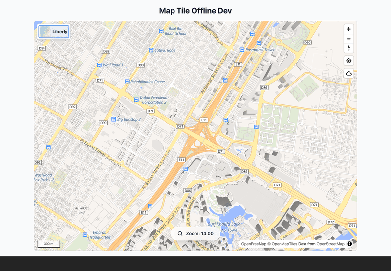

# Map GL Offline 🗺️

[](https://badge.fury.io/js/map-gl-offline)
[](https://opensource.org/licenses/MIT)
[](https://www.typescriptlang.org/)

**[📖 Documentation](https://map-gl-offline.netlify.app)** · **[🎮 Live Demo](https://map-gl-offline-demo.netlify.app)** · **[🐛 Issues](https://github.com/muimsd/map-gl-offline/issues)**

TypeScript offline-map library for **MapLibre GL JS** and **Mapbox GL JS**. Download styles, tiles, sprites, glyphs, and fonts to IndexedDB; load them back with zero network. Ships with a glassmorphic UI control and a complete programmatic API.



## Features

- 🗺️ **Offline regions** — polygon selection, smart tile management, extra vector/raster overlays
- 🎨 **Full resource capture** — styles, sprites, fonts, glyphs with Unicode ranges
- 🔗 **Mapbox GL + MapLibre GL** — auto-detection, `mapbox://` URL resolution, Standard style with 3D/terrain
- 📊 **Analytics & cleanup** — storage reports, auto-cleanup, quota-aware downloads
- 🎨 **UI control** — glassmorphic panel, dark/light themes, English/Arabic (RTL), polygon drawing
- 🛠️ **Programmatic API** — `downloadRegion` with per-phase progress, full TypeScript types

## Install

```bash
npm install map-gl-offline
```

Or via CDN as the `mapgloffline` global:

```html
<script src="https://unpkg.com/map-gl-offline/dist/index.umd.js"></script>
<link rel="stylesheet" href="https://unpkg.com/map-gl-offline/style.css" />
```

## Quick Start

### MapLibre GL JS

```typescript
import maplibregl from 'maplibre-gl';
import { OfflineMapManager, OfflineManagerControl } from 'map-gl-offline';
import 'maplibre-gl/dist/maplibre-gl.css';
import 'map-gl-offline/style.css';

const map = new maplibregl.Map({
  container: 'map',
  style: 'https://api.maptiler.com/maps/streets/style.json?key=YOUR_KEY',
  center: [-74.006, 40.7128],
  zoom: 12,
});

const offlineManager = new OfflineMapManager();

map.on('load', () => {
  const control = new OfflineManagerControl(offlineManager, {
    styleUrl: 'https://api.maptiler.com/maps/streets/style.json?key=YOUR_KEY',
    mapLib: maplibregl, // enables idb:// protocol in web workers
  });
  map.addControl(control, 'top-right');
});
```

### Mapbox GL JS

Mapbox GL JS v3 lacks `addProtocol`, so the library uses a Service Worker. Run **one** of:

```bash
npx map-gl-offline init            # CLI (recommended)
# or add to vite.config.js:
# import { offlineSwPlugin } from 'map-gl-offline/vite-plugin';
# plugins: [offlineSwPlugin()]
# or manually: cp node_modules/map-gl-offline/dist/idb-offline-sw.js public/
```

Then:

```typescript
import mapboxgl from 'mapbox-gl';
import { OfflineMapManager, OfflineManagerControl } from 'map-gl-offline';

mapboxgl.accessToken = 'YOUR_MAPBOX_TOKEN';

const map = new mapboxgl.Map({
  container: 'map',
  style: 'mapbox://styles/mapbox/standard',
  center: [-74.006, 40.7128],
  zoom: 12,
});

const offlineManager = new OfflineMapManager();
map.on('load', () =>
  map.addControl(
    new OfflineManagerControl(offlineManager, {
      styleUrl: 'mapbox://styles/mapbox/standard',
      accessToken: mapboxgl.accessToken,
    }),
    'top-right',
  ),
);
```

## Programmatic Usage

`downloadRegion` runs the full pipeline (**style → sprites → glyphs → models → tiles → metadata**) with per-phase progress. `addRegion` alone only stores metadata — use `downloadRegion` to actually fetch assets.

```typescript
import { OfflineMapManager } from 'map-gl-offline';

const offlineManager = new OfflineMapManager();

await offlineManager.downloadRegion(
  {
    id: 'downtown',
    name: 'Downtown',
    bounds: [[-74.0559, 40.7128], [-74.0059, 40.7628]],
    minZoom: 10,
    maxZoom: 16,
    styleUrl: 'https://api.maptiler.com/maps/streets/style.json?key=YOUR_KEY',
  },
  {
    onProgress: ({ phase, percentage, message }) => {
      console.log(`[${phase}] ${percentage.toFixed(1)}% ${message ?? ''}`);
    },
  },
);

// Manage
await offlineManager.listStoredRegions();
await offlineManager.getStoredRegion('downtown');
await offlineManager.deleteRegion('downtown');

// Analytics & cleanup
await offlineManager.getComprehensiveStorageAnalytics();
await offlineManager.cleanupExpiredRegions();
await offlineManager.setupAutoCleanup({ intervalHours: 24, maxAge: 30 });
```

### Sparse-source detection

For composite styles (e.g. Mapbox Standard) that reference sparse tilesets like `indoor-v3` or `landmark-pois-v1`, the tile downloader probes start/middle/end tiles per source and drops any that return majority-404. Disable with `tileOptions: { probeSourcesBeforeDownload: false }`.

### Recovering from an incompatible DB

If another app on the same origin has created `offline-map-db` at a newer version, `dbPromise` throws a typed error. Offer a reset UX:

```typescript
import { dbPromise, OfflineMapDBVersionError, resetOfflineMapDB } from 'map-gl-offline';

try {
  await dbPromise;
} catch (err) {
  if (err instanceof OfflineMapDBVersionError) {
    if (confirm('Offline storage is incompatible. Clear it?')) {
      await resetOfflineMapDB(); // destructive
      location.reload();
    }
  }
}
```

> **Upgrading from 0.5.x?** Read the [0.6.0 migration guide](https://map-gl-offline.netlify.app/docs/migration-0.6) — covers the rename of `ResourceService.getXxxStatistics` → `getXxxStats`, the `addRegion` vs `downloadRegion` split, and the `expiry` timestamp fix.

## API at a glance

- **Regions** — `downloadRegion`, `loadRegion`, `addRegion`, `getStoredRegion`, `listStoredRegions`, `listRegions`, `deleteRegion`
- **Analytics** — `getComprehensiveStorageAnalytics`, `getRegionAnalytics`, `getTileStats`, `getFontStats`, `getSpriteStats`, `getGlyphStats`
- **Cleanup** — `cleanupExpiredRegions`, `performSmartCleanup`, `cleanupOld{Fonts,Sprites,Glyphs}`, `verifyAndRepair{Fonts,Sprites,Glyphs}`, `setupAutoCleanup`, `performCompleteMaintenance`
- **Import / Export** — `exportRegionAsMBTiles`, `importRegion`, `downloadExportedRegion` (binary SQLite MBTiles, QGIS/tippecanoe-compatible)
- **Storage utilities** — `dbPromise`, `OfflineMapDBVersionError`, `resetOfflineMapDB`, `loadAllStoredRegions`, `resourceKeyBelongsToStyle`

See the **[full API reference](https://map-gl-offline.netlify.app/docs/api-reference)** and **[examples](https://map-gl-offline.netlify.app/docs/examples)** for every option and pattern.

## Browser compatibility

Chrome 51+ · Firefox 45+ · Safari 10+ · Edge 79+ · modern mobile browsers. Requires IndexedDB and ES2015+.

## Contributing

```bash
git clone https://github.com/muimsd/map-gl-offline.git
cd map-gl-offline && npm install
npm run dev          # dev harness
npm test             # unit tests
npm run build        # library
```

Issues and PRs welcome. See [CHANGELOG.md](CHANGELOG.md) for release notes.

## License

MIT © [Muhammad Imran Siddique](https://github.com/muimsd)

---

<div align="center">

[📖 Docs](https://map-gl-offline.netlify.app) · [🎮 Demo](https://map-gl-offline-demo.netlify.app) · [⭐ GitHub](https://github.com/muimsd/map-gl-offline)

<a href="https://www.buymeacoffee.com/muimsd" target="_blank"></a>

</div>
